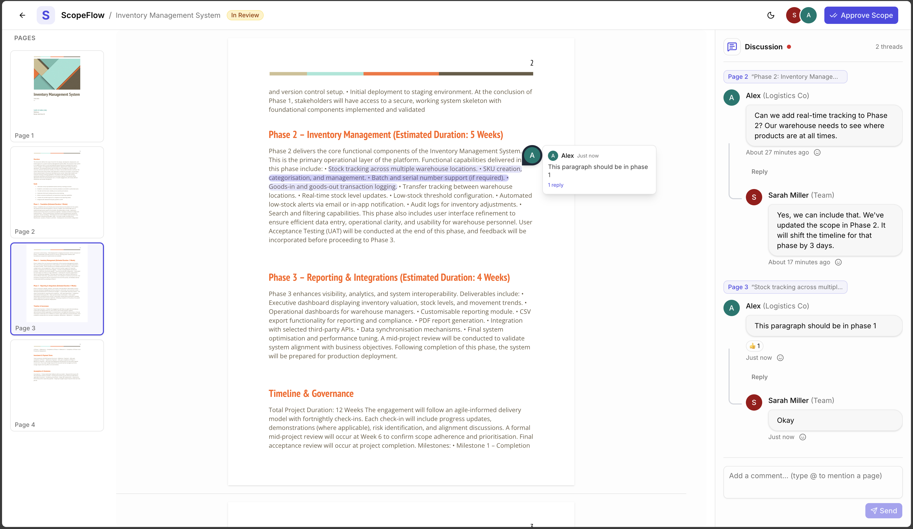

# ScopeFlow

A collaborative Scope of Work (SOW) review tool re-implemented in Vue 3, migrated from an original Next.js codebase. Stakeholders can preview a PDF scope document, leave threaded comments with annotations pinned to specific text selections, and formally approve the scope.



## Running Locally

**Prerequisites:** Node.js 20.19+ or 22.12+ (required by Vite 7)

```bash
# Install dependencies
npm install

# Start the dev server
npm run dev

# Production build
npm run build
npm run preview
```

The app runs at `http://localhost:5173` by default.

## Pages

| Route | Purpose |
|---|---|
| `/` | Landing page — project overview, PDF preview (iframe), and entry points to review or approve |
| `/review` | Full review experience — interactive PDF viewer with text selection, comment pins, threaded discussions, emoji reactions, and a side panel |
| `/approved` | Confirmation page — confetti animation, animated checkmark, and next-steps guidance |

## Tech Stack

- **Vue 3** with `<script setup>` SFCs
- **Vite 7** with the `@tailwindcss/vite` plugin
- **Tailwind CSS 4** with CSS-variable-based theming (light/dark)
- **Vue Router 5** with lazy-loaded routes for `/review` and `/approved`
- **pdfjs-dist** for canvas-based PDF rendering with text layers
- **lucide-vue-next** for icons
- **canvas-confetti** for the approval celebration

## Key Design Decisions

**Direct `pdfjs-dist` over `vue-pdf-embed`** — We initially used `vue-pdf-embed` for PDF rendering but hit persistent issues: a loading deadlock where page count was only available after render, and blank canvases from worker configuration problems. Switching to `pdfjs-dist` directly (rendering to `<canvas>` elements with a composable) gave us full control over the rendering pipeline, text layer placement, and z-index stacking — closely mirroring how `react-pdf` works in the original Next.js app.

**Composables for global state instead of Pinia** — The app has two pieces of shared state: theme preference and comment data. Both are simple enough that Vue composables with `ref`/`reactive` and `localStorage` persistence handle them cleanly without the overhead of a full store library. `useComments` and `useTheme` are imported directly where needed.

**`<Teleport>` for all floating UI** — Comment popups, hover previews, emoji pickers, and dropdowns are all teleported to `document.body`. This avoids clipping from `overflow: hidden` ancestors and z-index stacking context issues that were especially problematic inside the scrollable PDF container.

**SFCs over inline template components** — Early iterations used inline Options API components with string templates for things like `CommentPin` and `MessageBubble`. These silently failed because Vite's default Vue build excludes the runtime template compiler. Converting everything to proper `.vue` SFCs resolved the rendering issues and is more idiomatic Vue 3.

**CSS-variable theming inspired by shadcn/ui** — Rather than using a component library, we ported the shadcn/ui CSS variable system (`--background`, `--foreground`, `--primary`, etc.) into `style.css`. This gives us a consistent design language with dark mode support via a single `.dark` class toggle, while keeping the bundle lean.

## Assumptions

- **Single PDF document** — The app is hardcoded to render `scope-of-work.pdf` from the `public/` directory. A real deployment would fetch the document URL from an API.
- **Two fixed users** — Comments are authored by either "Alex" or "Sarah" (toggled in the UI). Authentication and real user identity are not implemented.
- **Client-side persistence only** — All comment data lives in `localStorage`. There is no backend API or database; refreshing the page restores the last saved state, but data doesn't sync across browsers or devices.
- **Static scope metadata** — Project name, client, dates, and budget shown on the landing page are hardcoded. In production these would come from a project management API.

## What I'd Tackle Next

- **Backend API & real-time sync** — Replace `localStorage` with a proper API (e.g. REST or WebSocket) so multiple reviewers can collaborate simultaneously and see each other's comments in real time.
- **Authentication & permissions** — Add user login so comments are tied to real identities, and support role-based access (reviewer vs. approver vs. read-only).
- **Testing** — Add unit tests for composables (`useComments`, `usePdf`) with Vitest, and component tests with Vue Test Utils. E2E tests with Playwright for the full review flow.
- **Accessibility** — Audit keyboard navigation through comment pins and the discussion panel, add proper ARIA labels to the PDF viewer, and ensure focus management in dialogs and popups.
- **PDF text search** — Leverage the existing text layer to implement in-document search with highlighting, making it easier to find specific sections in long scope documents.
- **Mobile responsiveness** — The review page layout (thumbnails + PDF + discussion panel) is optimized for desktop. A responsive redesign would collapse the panels into tabs or a drawer on smaller screens.
- **Performance at scale** — Virtualize the PDF page list so only visible pages are rendered to canvas, reducing memory usage for very long documents. Similarly, virtualize the comment thread list in the discussion panel.
